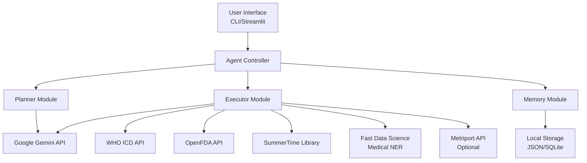

# Design Document

## Overview

The Intelligent Healthcare Navigator is designed as a modular agentic AI system following the ReAct (Reasoning and Acting) pattern. The architecture centers around Google Gemini API as the core reasoning engine, with specialized modules for planning, execution, and memory management. The system integrates multiple external healthcare APIs to provide comprehensive medical information while maintaining clear separation of concerns and extensibility.

## Architecture

### High-Level Architecture



### Core Agentic Workflow (ReAct Pattern)

1. **Reasoning Phase**: Planner analyzes user query and determines required actions
2. **Acting Phase**: Executor performs API calls and tool usage based on plan
3. **Observation Phase**: System processes results and updates memory
4. **Iteration**: Process repeats until query is fully resolved

## Components and Interfaces

### 1. Agent Controller (`src/agent.py`)

**Purpose**: Main orchestrator that coordinates between planner, executor, and memory modules.

**Key Methods**:
- `process_query(query: str, context: dict) -> str`: Main entry point for processing user queries
- `handle_document_upload(file_path: str) -> dict`: Processes uploaded medical documents
- `get_conversation_history() -> list`: Retrieves conversation context

### 2. Planner Module (`src/planner.py`)

**Purpose**: Analyzes user queries and creates execution plans using Gemini API.

**Key Classes**:
```python
class QueryPlanner:
    def analyze_query(self, query: str) -> QueryPlan
    def determine_tools_needed(self, query_type: str) -> list
    def create_execution_steps(self, analysis: dict) -> list

class QueryPlan:
    query_type: str  # medical_term, drug_info, symptoms, document_summary, entity_extraction
    tools_required: list
    execution_steps: list
    priority: int
```

**Integration Points**:
- Gemini API for natural language understanding and reasoning
- Memory module for context retrieval
- Predefined query classification patterns

### 3. Executor Module (`src/executor.py`)

**Purpose**: Executes planned actions by coordinating with external APIs and tools.

**Key Classes**:
```python
class ToolExecutor:
    def execute_plan(self, plan: QueryPlan) -> ExecutionResult
    def call_medical_term_api(self, term: str) -> dict
    def call_drug_info_api(self, drug_name: str) -> dict
    def process_symptoms(self, symptoms: str) -> dict
    def summarize_document(self, text: str) -> dict
    def extract_medical_entities(self, text: str) -> dict

class APIManager:
    def call_who_icd_api(self, term: str) -> dict
    def call_openfda_api(self, drug: str) -> dict
    def call_gemini_api(self, prompt: str, function_calls: list) -> dict
```

**External API Integrations**:

1. **WHO ICD API**:
   - Endpoint: `https://id.who.int/icd/release/11/2019-04/mms/search`
   - Purpose: Authoritative disease and medical term definitions
   - Authentication: API key required

2. **OpenFDA API**:
   - Endpoint: `https://api.fda.gov/drug/event.json` and `https://api.fda.gov/drug/enforcement.json`
   - Purpose: Drug recalls and adverse events
   - Authentication: API key recommended for higher rate limits

3. **Google Gemini API**:
   - Purpose: Core reasoning, NLU, and function calling
   - Models: gemini-pro for text, gemini-pro-vision for document processing
   - Authentication: API key required

4. **SummerTime Library**:
   - Purpose: Medical document summarization
   - Models: BART, T5, or specialized medical summarization models
   - Local processing, no API calls required

5. **Fast Data Science Libraries**:
   - `medspacy` for medical NER
   - `drug-named-entity-recognition` for drug extraction
   - Local processing, no API calls required

### 4. Memory Module (`src/memory.py`)

**Purpose**: Manages conversation context, user preferences, and caching.

**Key Classes**:
```python
class ConversationMemory:
    def store_interaction(self, query: str, response: str, metadata: dict)
    def get_context(self, limit: int = 10) -> list
    def clear_session(self)

class CacheManager:
    def cache_api_response(self, key: str, response: dict, ttl: int)
    def get_cached_response(self, key: str) -> dict
    def invalidate_cache(self, pattern: str)

class UserPreferences:
    def set_preference(self, key: str, value: any)
    def get_preference(self, key: str) -> any
```

**Storage Strategy**:
- SQLite database for conversation history and preferences
- In-memory caching for API responses (Redis-like functionality)
- JSON files for configuration and temporary data

## Data Models

### Core Data Structures

```python
@dataclass
class MedicalQuery:
    id: str
    query_text: str
    query_type: str
    timestamp: datetime
    user_context: dict

@dataclass
class MedicalResponse:
    query_id: str
    response_text: str
    sources: list
    confidence_score: float
    medical_entities: list
    disclaimers: list

@dataclass
class MedicalEntity:
    text: str
    entity_type: str  # disease, drug, symptom, procedure
    confidence: float
    source_api: str
    additional_info: dict

@dataclass
class DocumentSummary:
    original_text: str
    summary: str
    key_findings: list
    extracted_entities: list
    document_type: str  # prescription, lab_report, medical_note
```

### API Response Models

```python
class WHOICDResponse:
    def __init__(self, api_response: dict):
        self.title = api_response.get('title', {}).get('@value', '')
        self.definition = api_response.get('definition', {}).get('@value', '')
        self.code = api_response.get('code', '')

class OpenFDAResponse:
    def __init__(self, api_response: dict):
        self.recalls = api_response.get('results', [])
        self.adverse_events = []
        self.total_count = api_response.get('meta', {}).get('results', {}).get('total', 0)
```

## Error Handling

### Error Categories and Strategies

1. **API Failures**:
   - Implement exponential backoff for transient failures
   - Fallback to cached responses when available
   - Graceful degradation with alternative data sources

2. **Authentication Errors**:
   - Clear error messages for missing or invalid API keys
   - Guidance for obtaining required credentials
   - Fallback to limited functionality where possible

3. **Rate Limiting**:
   - Implement request queuing and throttling
   - Cache frequently requested information
   - User notification of temporary delays

4. **Data Processing Errors**:
   - Validation of input data formats
   - Sanitization of user inputs
   - Clear error messages for unsupported file types

5. **Medical Disclaimer Handling**:
   - Automatic inclusion of medical disclaimers
   - Clear warnings about diagnostic limitations
   - Emergency contact information for urgent symptoms

### Error Response Format

```python
@dataclass
class ErrorResponse:
    error_code: str
    error_message: str
    user_message: str
    suggested_actions: list
    timestamp: datetime
    context: dict
```

## Testing Strategy

### Unit Testing

1. **Planner Module Tests**:
   - Query classification accuracy
   - Tool selection logic
   - Plan generation completeness

2. **Executor Module Tests**:
   - API integration functionality
   - Error handling scenarios
   - Response parsing accuracy

3. **Memory Module Tests**:
   - Data persistence and retrieval
   - Cache functionality
   - Context management

### Integration Testing

1. **End-to-End Workflows**:
   - Complete query processing cycles
   - Multi-step reasoning scenarios
   - Document upload and processing

2. **API Integration Tests**:
   - External API connectivity
   - Response handling
   - Fallback mechanisms

### Mock Testing Strategy

- Mock external APIs for consistent testing
- Simulate various error conditions
- Test rate limiting and timeout scenarios

### Performance Testing

- Response time benchmarks for different query types
- Memory usage monitoring
- Concurrent user simulation

## Security and Privacy Considerations

### Data Protection

1. **User Data**:
   - No persistent storage of sensitive medical information
   - Session-based data handling
   - Clear data retention policies

2. **API Security**:
   - Secure API key management via environment variables
   - HTTPS-only communications
   - Input sanitization and validation

3. **Medical Privacy**:
   - HIPAA-aware design principles
   - No diagnostic claims or medical advice
   - Clear disclaimers and limitations

### Compliance Considerations

- Medical disclaimer requirements
- Data processing transparency
- User consent for data usage
- Audit trail for system interactions

## Deployment and Configuration

### Environment Setup

```bash
# Required environment variables
GEMINI_API_KEY=your_gemini_api_key
WHO_ICD_API_KEY=your_who_api_key
OPENFDA_API_KEY=your_fda_api_key  # Optional but recommended
METRIPORT_API_KEY=your_metriport_key  # Optional
```

### Dependencies

```python
# Core dependencies
google-generativeai>=0.3.0
requests>=2.28.0
streamlit>=1.28.0
sqlite3  # Built-in
pandas>=1.5.0
python-dotenv>=0.19.0

# Medical NLP libraries
summertime-text>=1.0.0
medspacy>=1.0.0
drug-named-entity-recognition>=1.0.0

# Document processing
PyPDF2>=3.0.0
python-docx>=0.8.11
```

### Interface Options

1. **CLI Interface** (`src/cli.py`):
   - Command-line interaction
   - Suitable for scripting and automation
   - Minimal dependencies

2. **Streamlit Web Interface** (`src/web_app.py`):
   - User-friendly web interface
   - File upload capabilities
   - Interactive conversation history
   - Real-time response streaming